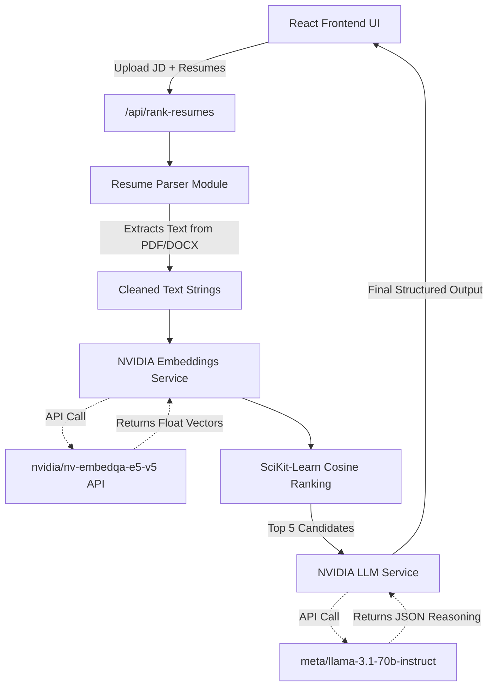

# EasyHire 🤖💼

live at : https://easy-hire-nine.vercel.app/ 

An intelligent, production-ready system that automates the recruitment shortlisting process. It semantically matches candidate resumes against a Job Description (JD) using **NVIDIA NIM AI** (Embeddings & Large Language Models) to rank candidates and provide explainable AI reasoning.

---

## 🚀 Features

- **Multi-Format Parsing:** Seamlessly extracts text from `.pdf` and `.docx` resumes and JDs.
- **Semantic Vector Search:** Converts text into high-dimensional vectors to mathematically find the closest conceptual matches to the job requirements, completely ignoring keyword-stuffing.
- **AI-Powered Reasoning:** Uses a flagship Large Language Model (LLaMA 3.1 70B via NVIDIA NIM) to read the top candidates' resumes and explicitly extract matching skills, missing skills, and provide a 0-100 score + English explanation of the candidate's fit.
- **Premium UI:** A beautifully designed Vite + React frontend with glassmorphism, dynamic color-coding, and micro-animations.
- **Microservices Backend:** FastAPI backend featuring fully isolated endpoints for each specific AI operation.

---

## 🧠 System Architecture



---

## 🛠️ Tech Stack

### Backend
- **Python 3.10+ / FastAPI**: High-performance asynchronous API framework.
- **NVIDIA NIM API**: Provides access to optimized AI models hosted by NVIDIA.
  - *Embedding Model:* `nvidia/nv-embedqa-e5-v5` (Transforms text to vectors)
  - *LLM Reasoning Model:* `meta/llama-3.1-70b-instruct` (Analyzes text and forms judgements)
- **PyPDF2 & python-docx**: Document text extraction.
- **scikit-learn & numpy**: For mathematically computing Cosine Similarity between vectors.

### Frontend
- **React 18 + Vite**: Lightning-fast modern frontend setup.
- **Axios & Lucide React**: Network requests and beautiful iconography.
- **Vanilla CSS**: Hand-written premium aesthetic styling with custom CSS variables and animations.

---

## 📂 Project Structure

```text
D:\AI_resume_ranker\
│
├── .env                  # Environment variables (NVIDIA_API_KEY)
├── README.md             # This documentation file
│
├── backend/              # Python FastAPI Server
│   ├── app.py            # Main API routing and orchestration logic
│   ├── uploads/          # Temporary storage for uploaded resumes and JDs
│   └── service/          # Independent Microservices
│       ├── resume_parser.py # PDF/DOCX parsing logic
│       ├── embeddings.py    # Talks to NVIDIA embedding API
│       ├── ranker.py        # Cosine similarity vector math
│       └── llm.py           # Talks to NVIDIA LLaMA 3.1 API for reasoning
│
├── frontend/             # React + Vite Web Application
│   ├── index.html        # App entry point
│   ├── package.json      # NPM dependencies
│   ├── vite.config.js    # Vite builder config
│   └── src/
│       ├── main.jsx      # React initialization
│       ├── App.jsx       # Main UI component (Drag/Drop + Results)
│       └── index.css     # Premium styling logic
│
└── tests/                # Pytest Integration Suite
    └── test_services.py  # Tests ensuring NVIDIA APIs and math rankers work perfectly
```

---

## ⚙️ Setup & Installation

### 1. Backend Setup
Make sure you have Python installed.
```bash
# 1. Activate your virtual environment (if using one)
# 2. Install Python dependencies
pip install fastapi uvicorn python-multipart pypdf2 scikit-learn numpy python-docx python-dotenv openai

# 3. Add your NVIDIA API Key to `.env` in the root folder:
# NVIDIA_API_KEY=nvapi-...

# 4. Start the backend server
cd backend
uvicorn app:app --reload
```
*The backend will be available at `http://localhost:8000`*

### 2. Frontend Setup
Make sure you have Node.js installed.
```bash
# 1. Navigate to frontend
cd frontend

# 2. Install NPM packages
npm install

# 3. Start the Vite React server
npm run dev
```
*The UI will be available at `http://localhost:5173`*

---

## 🔌 API Documentation

If you wish to use the Backend strictly as a headless API, it exposes the following independent routes:

- `POST /api/extract-text`: Send a file, get back cleaned text.
- `POST /api/generate-embedding`: Send text, get back an NVIDIA vector embedding array.
- `POST /api/evaluate-candidate`: Send a JD and a Resume, get back LLaMA 3.1's structured JSON opinion.
- `POST /api/rank-resumes`: Send a master JD file and multiple resume files. Returns the final, fully-ranked and reasoned Candidate Array for the UI to consume.
